<p align="center">
  
</p>

<h1 align="center">ExploreSF</h1>

<p align="center">
  A native iOS travel companion for San Francisco — 1,406 places, five layers of the city, one pocket-sized guidebook.
</p>

<p align="center">
  
  &nbsp;
  
  &nbsp;
  
  &nbsp;
  
  &nbsp;
  
</p>

---

## Origin — Built at SFHacks, Won the Gator Sprint

ExploreSF was built in a single day at **SFHacks' Gator Sprint** on **May 1st, 2026** — a hackathon sprint held at SF State with the theme *"Build for SF."* The premise was simple: build something that makes San Francisco more discoverable. I shipped a complete iOS app from scratch in one sprint, presented it, and won 2nd prize.

<p align="center">
  
</p>
<p align="center"><sub>Receiving the prize at SFHacks · Gator Sprint · May 1, 2026 · "Build for SF"</sub></p>

The idea had been forming for a while. San Francisco has layers that most people never reach — a park tucked behind a corporate lobby, a mural that has watched the neighborhood change for thirty years, a street corner where *The Matrix* was shot, a hidden garden on the fourteenth floor that's legally required to be open to the public. All of that exists, documented in city datasets, but scattered and unusable. *What if it lived in one app, beautifully?*

That question became ExploreSF.

---

## What It Is

ExploreSF is a curated, map-first travel guide to San Francisco. Five categories of city data — Film Locations, Public Open Spaces (POPOS), Parks & Recreation, Public Art, and Entertainment venues — are surfaced on a live MapKit map and browseable as an editorial list. Every pin connects to a rich detail view with Apple LookAround street-level imagery and, for film locations, live metadata from TMDB: posters, cast, director, rating, and more.

When you find places you want to visit, you bookmark them. When you are ready to go, you drop your saved places into the itinerary planner and the app builds a GPS-optimized, walkable route — ordered from your current location using a nearest-neighbor algorithm, spread across however many days you choose.

No account. No cloud. No subscriptions. Every dataset is bundled on-device.

---

## First Launch — Onboarding & Category Picker

<table align="center"><tr>
  <td align="center">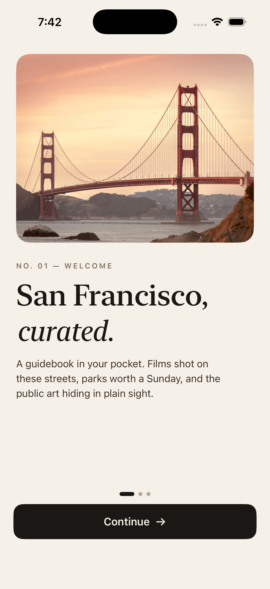<br/><sub>San Francisco, curated.</sub></td>
  <td align="center">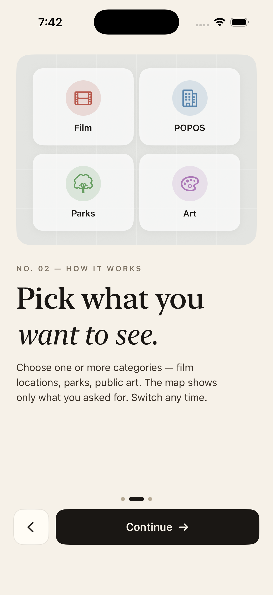<br/><sub>Pick what you want to see.</sub></td>
  <td align="center">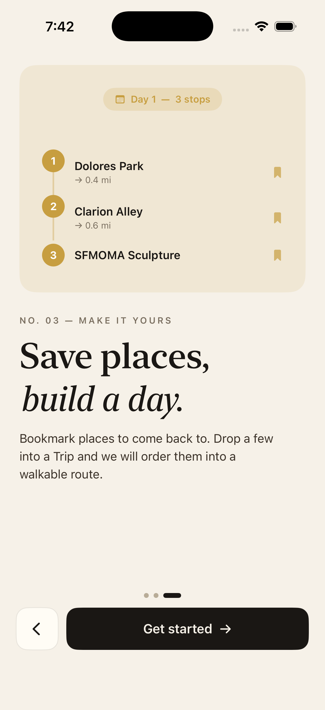<br/><sub>Save places, build a day.</sub></td>
  <td align="center">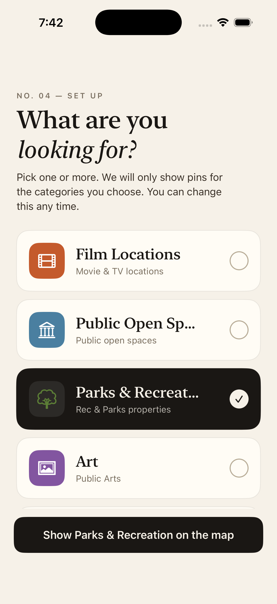<br/><sub>Choose your layers</sub></td>
</tr></table>

<br/>

Three panels introduce the app's concept — what the city holds, how to explore it, and how to turn bookmarks into a walkable plan. After onboarding, a full-screen category picker lets you choose exactly which layers to load onto the map. Your selection persists across restarts and can be changed any time from the map tab.

---

## The Map — Five Categories, 1,406 Places

<table align="center"><tr>
  <td align="center">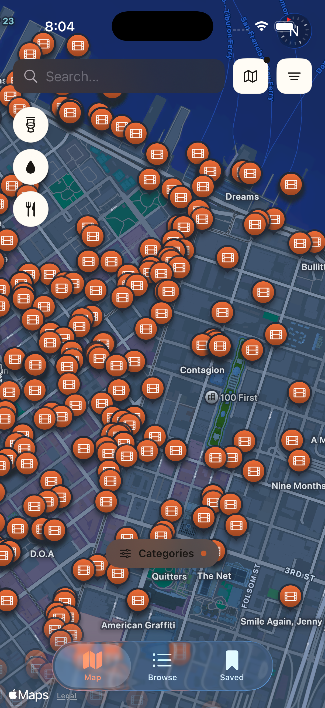<br/><sub>🎬 Film Locations — 299 places</sub></td>
  <td align="center">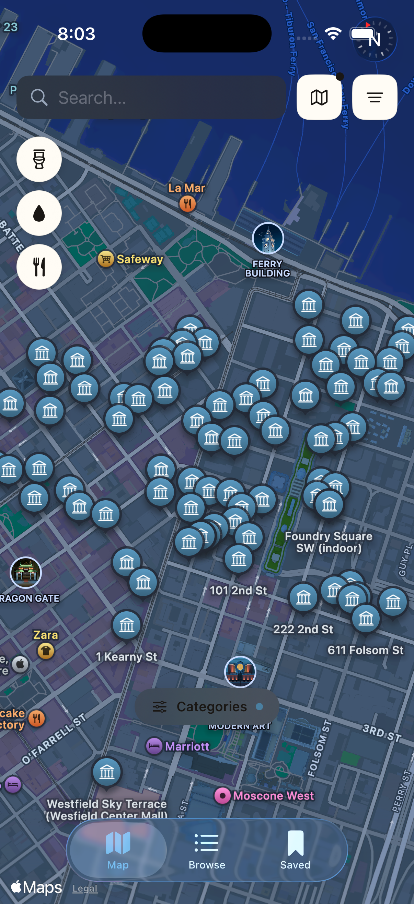<br/><sub>🏛 Public Open Spaces — 81 places</sub></td>
  <td align="center">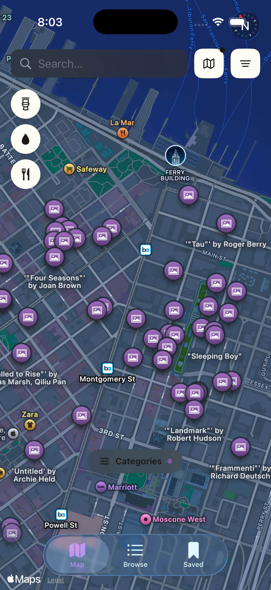<br/><sub>🎨 Public Art — 65 places</sub></td>
</tr></table>

<br/>

<table align="center"><tr>
  <td align="center">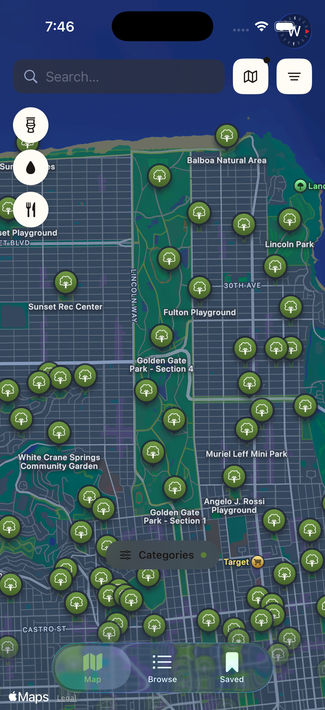<br/><sub>🌳 Parks & Recreation — 254 places</sub></td>
  <td align="center">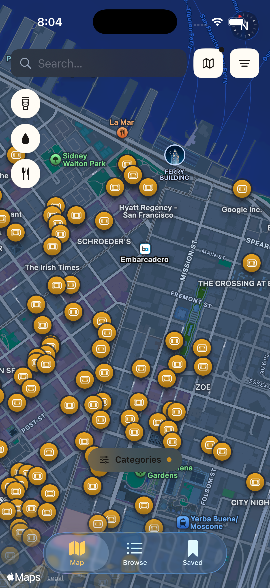<br/><sub>🎭 Entertainment Venues — 707 places</sub></td>
  <td align="center">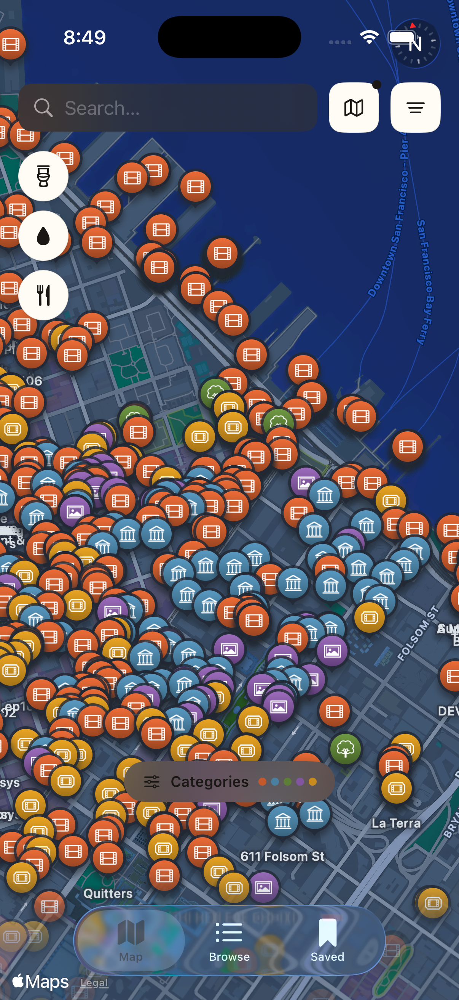<br/><sub>All categories at once</sub></td>
</tr></table>

Each category is its own color-coded layer. Toggle them independently from the bottom bar, or combine all five for a complete picture of the city.

- Live **MapKit** map with color-coded markers for all five categories
- **Park polygon boundaries** rendered as semi-transparent `MapPolygon` overlays — see the actual footprint of every Recreation & Parks property
- **Utility overlays** for public bathrooms, water fountains (with bottle-filler & dog fountain flags), and food trucks — each toggled independently from a floating side bar
- **Category quick-toggle bar** at the bottom — show exactly the layers you want, switch in one tap
- Pin tap opens a bottom sheet with place summary, LookAround preview, and a deep-link into Apple Maps for directions

---

## Browse & Search

<table align="center"><tr>
  <td align="center">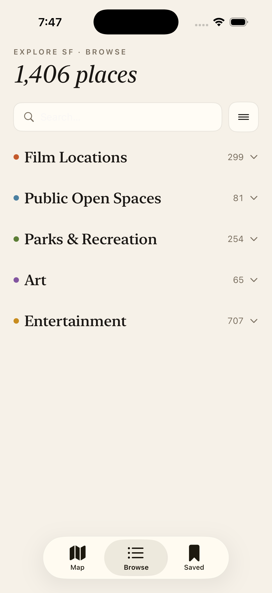<br/><sub>1,406 places across five categories</sub></td>
</tr></table>

<br/>

- Editorial accordion list across all five categories — **1,406 places** total
- Live search across titles, addresses, and location names
- Per-category filtering:
  - **Film** — Release year, neighborhood, actor (async TMDB person search)
  - **Parks** — Neighborhood, park type
  - **POPOS** — Space type, features (indoor, food service, art, restrooms)
  - **Art** — Art type, medium
  - **Entertainment** — Venue type, neighborhood
- Actor filter runs a TMDB person search and collects all titles from their film & TV credits, then narrows the map to only those filming locations

### Detail Screens & Street-Level Preview

<table align="center"><tr>
  <td align="center">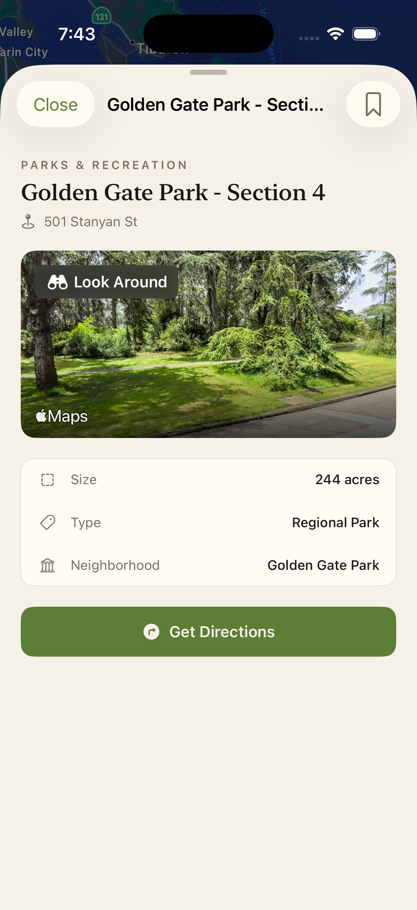<br/><sub>244-acre detail sheet with LookAround</sub></td>
  <td align="center">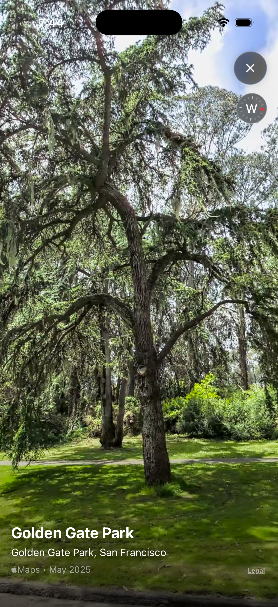<br/><sub>Apple LookAround — immersive street view</sub></td>
</tr></table>

<br/>

- Every category has a full-screen detail modal: header, LookAround hero, info table, and directions button
- **Film detail** goes further — TMDB-backed poster, rating, tagline, overview, director, top cast, genres, runtime, and a complete list of every filming location, each one tappable to fly to that pin on the map
- **POPOS detail** surfaces amenity chips (indoor/outdoor, food, art, restrooms, seating) and opening hours
- Apple **LookAround** is available at every pin across all five categories — singleton scene cache with **rate limiting** (≤ 40 requests/minute, ≥ 1.5s between requests) and in-flight task deduplication
- Lazy-loaded LookAround thumbnails in list rows and detail sheets; falls back to a category-colored icon placeholder when street-level imagery is unavailable

### Bookmarks & Saved Places

<table align="center"><tr>
  <td align="center">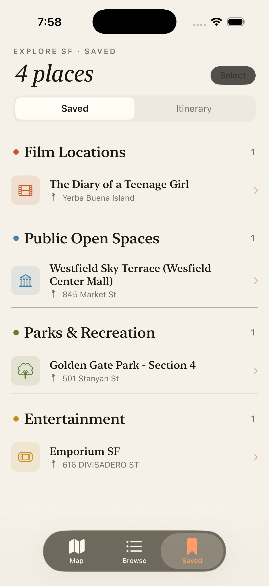<br/><sub>Bookmarks, grouped by category</sub></td>
</tr></table>

<br/>

- Tap the bookmark icon on any pin, list row, or detail screen to save a place
- **SwiftData** persistence with a compound key (`category:originalId`) for uniqueness
- Saved tab groups bookmarks by category with swipe-to-delete and multi-select bulk delete

### Itinerary Planner

<table align="center"><tr>
  <td align="center">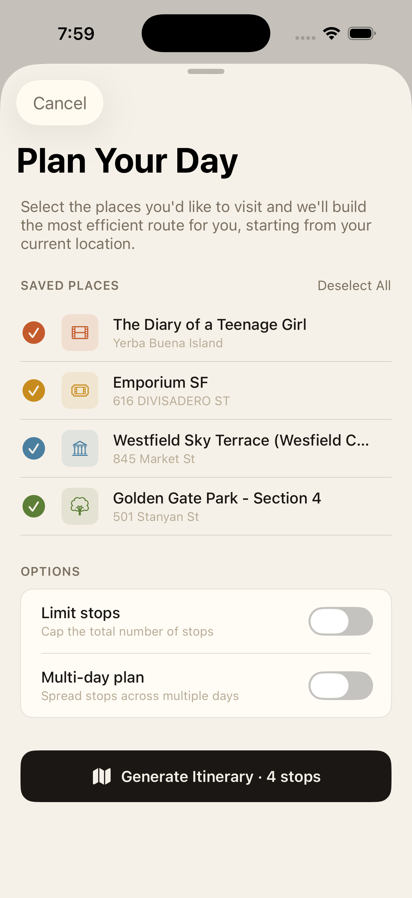<br/><sub>Select saved places, set options, generate</sub></td>
  <td align="center">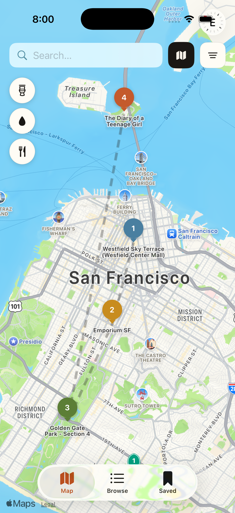<br/><sub>GPS-optimized route with numbered stops</sub></td>
</tr></table>

<br/>

- Select any combination of saved places and tap **Generate Itinerary**
- **Nearest-neighbor routing** from your GPS position — greedily picks the closest unvisited stop each step for a practical walking order
- Options: cap the total number of stops; spread stops across **1–7 days** for a multi-day trip
- Day selector in both the Itinerary tab and on the map; per-day stop lists with a visual progress bar
- Each stop has a completion toggle — mark it visited as you walk
- Itinerary map mode: numbered stop annotations + dashed `MapPolyline` connector per day

#### How It Works

The planner solves a practical variant of the Travelling Salesman Problem — not optimally (NP-hard), but well enough for city walking.

When you tap Generate, the app:

1. **Anchors at your GPS location** via CoreLocation — or the geographic centroid of your selected places if location is denied.
2. **Runs nearest-neighbor**: from the current position, find the closest unvisited stop (Haversine distance), move there, repeat until the stop budget is exhausted.
3. **Distributes across days** by dividing the ordered list into equal-length chunks — Day 1 gets the first N stops in route order, Day 2 the next N, and so on.
4. **Writes to SwiftData** — the plan persists across restarts, and each stop records a `completedAt` timestamp when checked off.

The algorithm runs synchronously on the `@MainActor` (the dataset is small enough that greedy nearest-neighbor completes in microseconds), while the CoreLocation anchor lookup uses Swift structured concurrency.

---

## Tech Stack

| | |
|---|---|
| **Language** | Swift |
| **UI Framework** | SwiftUI — `@Observable` throughout, no `ObservableObject` |
| **Maps** | MapKit — `Map`, `Marker`, `Annotation`, `MapPolyline`, `MapPolygon`, `MKLookAroundScene` |
| **Persistence** | SwiftData — `SavedPlace`, `ItineraryPlan`, `ItineraryStop` |
| **External API** | TMDB — movie/TV search, detail, credits, actor filmography |
| **Concurrency** | Swift structured concurrency — `Task.detached` for data loading, `async/await` for TMDB & LookAround |
| **Location** | CoreLocation — GPS anchor for itinerary start point |
| **State** | `@Observable` ViewModels, `@Environment` injection, `UserDefaults` for onboarding & category persistence |
| **Data** | Five bundled GeoJSON datasets — no network calls for place data |
| **Design System** | Custom editorial palette — New York serif headlines, warm cream travel-magazine aesthetic |
| **Deployment Target** | iOS 26+ |
| **Dependencies** | None |

---

## Project Structure

```
ExploreSF/
├── App/
│   ├── ExploreSFApp.swift          ← @main, SwiftData container, environment setup
│   └── Assets.xcassets/
│
├── Navigation/
│   ├── AppRouter.swift             ← @Observable: selectedTab, activeCategories, pendingPin (UserDefaults-backed)
│   └── AppRouterView.swift         ← Onboarding → CategoryPicker → TabView
│
├── DesignSystem/
│   ├── AppColors.swift             ← Paper/ink/card/accent tokens (#F6F1E8 cream palette)
│   └── AppFonts.swift              ← New York serif headlines, eyebrow style, body scale
│
├── Models/
│   ├── AppCategory.swift           ← enum: film/popos/park/art/entertainment — color, icon, displayName
│   ├── PlacePin.swift              ← Shared lightweight map-pin value type
│   ├── FilterState.swift           ← Per-category filter parameters
│   ├── SavedPlace.swift            ← @Model: bookmarks
│   ├── ItineraryPlan.swift         ← @Model: active trip plan
│   ├── ItineraryStop.swift         ← @Model: individual stop with completion state
│   ├── FilmLocation / FilmEntry    ← Film data + TMDB grouping
│   ├── POPOS/                      ← POPOSPlace + GeoJSON decode
│   ├── Parks/                      ← ParkPlace + ParkPolygon + GeoJSON decode
│   ├── Art/                        ← ArtPlace + GeoJSON decode
│   └── TMDB/                       ← TMDBDetail, TMDBCredits, search types
│
├── Services/
│   ├── DataStore.swift             ← @Observable: async-loads all datasets at app start
│   ├── Load{Category}Data.swift    ← One nonisolated loader per dataset
│   ├── TMDBService.swift           ← Actor-isolated TMDB client with response caching
│   └── LookAroundSceneCache.swift  ← Rate-limited singleton (≤40 req/min)
│
├── ViewModels/
│   ├── MapViewModel.swift          ← Map state, filtered pins, visible polygons, actor filter
│   ├── BrowseListViewModel.swift   ← List state, search, poster lazy-loading
│   ├── ItineraryManager.swift      ← Nearest-neighbor planner, completion tracking
│   ├── MovieDetailViewModel.swift  ← TMDB detail + credits async fetch
│   └── {Category}DetailViewModel   ← LookAround per category
│
├── Views/
│   ├── Map/                        ← ExploreMapView, pin sliders, filter sheet, category bar
│   ├── Browse/                     ← BrowseListView + per-category row views
│   ├── Saved/                      ← SavedView (bookmarks + itinerary tabs)
│   ├── Itinerary/                  ← ItineraryPlanView, setup sheet, stop rows
│   ├── MovieDetail/                ← Full film detail with TMDB data
│   ├── {Category}Detail/           ← Full detail modals per category
│   ├── CategoryPicker/             ← Multi-select modal
│   ├── Onboarding/                 ← 3-panel carousel with custom SwiftUI illustrations
│   └── Shared/                     ← BookmarkButton, SearchBar, LookAroundPreview, PosterImage
│
└── Resources/
    ├── Film_Locations_in_San_Francisco.geojson
    ├── Privately_Owned_Public_Open_Spaces.geojson
    ├── Recreation_and_Parks_Properties.geojson
    ├── Public_Art.geojson
    └── Active_Entertainment_Permits.geojson
```

---

## Getting Started

**Requirements:** Xcode 17 and an iOS 26 simulator or device. One external API key required.

```bash
git clone https://github.com/keyursavalia/ExploreSF.git
cd ExploreSF
open ExploreSF.xcodeproj
```

In `Config.swift`, add your [TMDB API key](https://www.themoviedb.org/settings/api):

```swift
static let tmdbAPIKey = "YOUR_KEY_HERE"
```

Press `Cmd R`. All five place datasets load from bundled GeoJSON — no backend, no database setup. TMDB is the only network dependency; the app degrades gracefully if the key is absent (film rows appear without posters or cast info).

---

## What's Next

- **EntertainmentDetail + Art deep links** — full detail modals matching the depth of Film and POPOS
- **Food Trucks overlay** — the dataset is bundled and parsed; surface it on the map alongside bathrooms and fountains
- **Offline TMDB cache** — persist poster and credit data to SwiftData so film detail works without a connection
- **Home screen widget** — glanceable "place of the day" drawn from your saved bookmarks
- **Share sheet** — export a day's itinerary as formatted text to send to whoever you're exploring with
- **Accessibility pass** — full VoiceOver audit across all five category detail screens and the itinerary flow

---

## Contributing

Fork the repo, branch from `main`, one fix or feature per PR. Commit prefixes: `init:` / `update:` / `fix:`. Bug reports and ideas are welcome as GitHub issues.

---

## Data Sources

All place data is sourced from [DataSF](https://data.sfgov.org) — the City and County of San Francisco's open data portal. Datasets are published under the [Public Domain Dedication and License (PDDL)](https://opendatacommons.org/licenses/pddl/1-0/).

| Dataset | Publisher | Link |
|---|---|---|
| Film Locations in San Francisco | SF Film Commission | [data.sfgov.org ↗](https://data.sfgov.org/Culture-and-Recreation/Film-Locations-in-San-Francisco/yitu-d5am) |
| Privately Owned Public Open Spaces (POPOS) | SF Planning Department | [data.sfgov.org ↗](https://data.sfgov.org/Culture-and-Recreation/Privately-Owned-Public-Open-Spaces/65ik-7wqd) |
| Recreation and Parks Properties | SF Recreation and Parks Department | [data.sfgov.org ↗](https://data.sfgov.org/Culture-and-Recreation/Recreation-and-Parks-Properties/gtr9-ntp6) |
| Public Art | SF Arts Commission | [data.sfgov.org ↗](https://data.sfgov.org/Culture-and-Recreation/Public-Art/gfan-jd9y) |
| Entertainment Commission's Places of Entertainment | SF Entertainment Commission | [data.sfgov.org ↗](https://data.sfgov.org/Culture-and-Recreation/Entertainment-Commission-s-Places-of-Entertainment/86e8-rfem) |
| San Francisco Public Bathrooms and Water Fountains | SF Recreation and Parks / Public Works | [data.sfgov.org ↗](https://data.sfgov.org/City-Infrastructure/San-Francisco-Public-Bathrooms-and-Water-Fountains/hvr9-9r5z) |

Film and TV metadata (posters, cast, ratings, overviews) is provided by the [TMDB API](https://www.themoviedb.org). This product uses the TMDB API but is not endorsed or certified by TMDB.

---

## License

[MIT](LICENSE) · © 2026 Keyur Savalia
